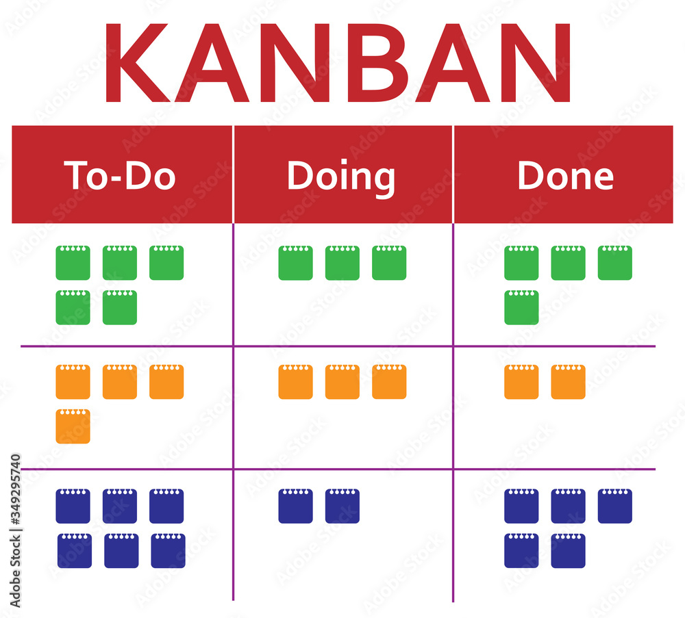

**Terms of Reference for writing an article**

**Topic:** How Scrum differs from Kanban.

**Limit:** 40-60 characters, including spaces.

**Objective:** To describe the key differences between Scrum and Kanban to help the LDT-X team decide which of these two Agile methods is best suited for managing the Y project workflow.

**Keywords:** Agile methodologies, Scrum, sprint, retrospective, Kanban, Kanban board, WIP.

**Character limit per article:** up to 5000 characters, including spaces.

**Description:** up to 160 characters, including spaces.

**Purpose:** To explain to the analyst and project manager the main features of Scrum and Kanban, their differences and peculiarities.

**Target Audience:** LDT-X analyst and project manager.

**Writing style:**

* Use third-person narrative.
* Use the present tense most of the time because to the reader, tasks and actions occur in the present tense. Use the future tense only when necessary.
* Use simple sentences with direct word order.
* Avoid humor.
* Do not ascribe human qualities to computers and programs.
* Do not use "We recommend" or "It is recommended that."
* The text should be "dry" and informative.
* The text should be easy to read, relevant to the topic, and fully disclose it.
* Ensure that the information is complete, accurate, and clear.
* Follow typographical guidelines.

**Structure of the text:**

* Introduction.
* The main part, consisting of at least 2 subsections.
* Conclusion.
* The text should be divided into paragraphs.
  
**Illustrations:** To demonstrate the differences, add images or test documents in one of the formats: jpeg, png, gif. Images should be added directly to the article, test documents should be referenced by name.

**The text should not contain:**

* Links to external resources.
* Spelling, grammar, punctuation, etc. errors.
  
**Uniqueness:** 95% or higher by plagiarism checker (https://smallseotools.com/plagiarism-checker/).

**Meta description:**

Scrum and Kanban are two Agile methodology approaches that greatly simplify and regulate IT workflows. However, there are significant differences between them.
# How Scrum differs from Kanban
In modern software development, ***Agile methodologies*** are becoming one of the most effective approaches in project management. ***Kanban*** and ***Scrum***, as two varieties of ***Agile***, allow teams to organize the work process as efficiently as possible and achieve rapid development or product launch. This article describes the essence of each of these agile methods and the fundamental difference between them. After reading the text you will be able to understand which of these approaches is most suitable for implementing a Y project.
## What is Agile
Before we start looking at ***Kanban*** and ***Scrum*** methods, let's understand what is at the core of ***Agile methodology***.
### The principle of iterations
The main principle of this approach is to help teams respond flexibly to changes in the project, as well as to quickly identify problems and errors and find a way to solve them. This method is based on ***iterations*** - time fixed intervals during which the team implements the project in stages.
### Make a mistake - go back.
In contrast to the ***Waterfall*** tangential model, the ***Agile*** principle in the process of creating a product does not exclude the repetition of stages. How does this happen in practice? Once the team starts the project, guided by the terms of reference, iterate by iterate, it gets closer to the finish line, going back to the previous stage if necessary. The intermediate results of each iteration can be discussed with the customer, and, having received his recommendations, the necessary adjustments can be made. This principle of work is typical for ***Kanban*** and ***Scrum***. But with some differences between them. Let's dwell on these methods in more detail.
## Scrum: from sprint to retrospective
***Scrum*** is not unreasonably called the "revolutionary project management method". Let's take a closer look at it. 
### One week's worth of deliverables
At the core of ***Scrum*** is the breakdown of project work into time-limited periods - sprints. In one ***sprint*** of 1-2 weeks, the team receives an intermediate result. Each time after its completion, a ***retrospective*** is organized - a regular meeting at which the team discusses problems encountered during this phase of the work process and makes changes. If the ***sprint*** has already started, it is not possible to add new tasks to it. It is necessary to wait for its completion.
### Scrum team
In ***Scrum***, each team member has a role and area of responsibility in the project. This is how the ***Scrum*** master builds the communication process in the team. The product owner, having analyzed business, customer and market requirements, sets tasks for the ***Scrum*** team. The latter are responsible for the work to implement the components of the backlog - a list of requirements or errors that need to be corrected in the product.

Focusing the team's work on a certain number of tasks, limiting the time limits of the sprint, and the personal responsibility for their part of the work of each team member allows to achieve fast results. Figure 1 shows how to run a ***sprint*** as a team:

{:height="100px" width="300 px"}

Figure 1

## Kanban: even more flexibility
Compared to ***Scrum***, ***Kanban*** has even more flexibility. There is no priority in fixed deadlines. The team implements the project in a continuous flow. Let's take a closer look at the features of this method. 
### Responsibilities without roles
In ***Kanban***, there are no defined roles within the team. Different subject specialists may be involved in solving the problem. For example, analysts work at the start of the project, then they are joined by designers, and then, at the third stage, the developers are involved.
### Staking on visualization 
Unlike ***Scrum***, ***Kanban*** has no time-limited sprints. The workflow is continuous with the ability to integrate new tasks.
 
***Kanban*** relies on visualization of work steps. Goals and tasks as well as all process activity are visually displayed on a ***Kanban board***. Each column of the ***board*** shows a different work phase. For example, it may have designations such as "Goals at Start", "In Progress", and "Completed". Each work goal is a card on the ***board*** which, when completed, moves from left to right to the next phase. The final result of the work gets into the "Completed" column.
### Task Limit
A feature of ***Kanban*** is the principle of ***work-in-progress limit (WIP)***. This means that the number of tasks in work at the same time on the same stage is limited. This helps the team avoid overload and work more efficiently on a particular task list. Figure 2 below shows one of the variants of a ***kanban board*** with task stickers:

{:height="100px" width="300px"}

Figure 2

## To summarize: Scrum or Kanban?
***Scrum*** is very useful for software development when the team starts to create a product under uncertainty. For example, if the question remains open as to how much functionality there will be and what their potential relevance is. In this case, it is rational to work in sprints, creating ready functionality at the end of each and introducing changes into the project.

***Kanban*** is more advantageous when the project plan needs quick changes without waiting for the next sprint. This is especially true when the team has a regular influx of tasks - for example, from 4-5 clients, but there is no single product they are responsible for.

Let's also keep in mind the idea of combining the capabilities of these two methods to develop your own effective strategy for Y project management. 